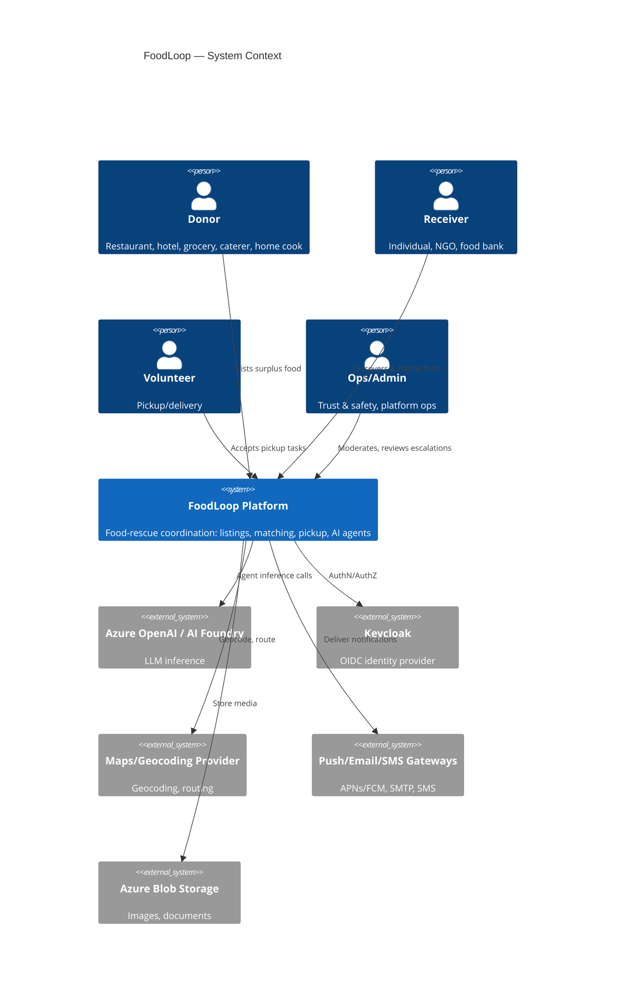
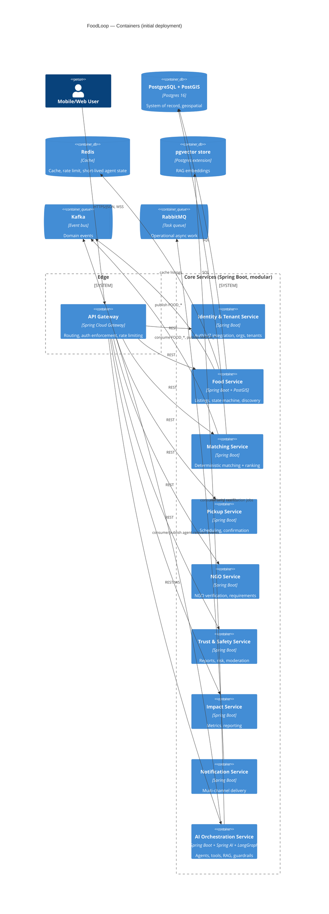
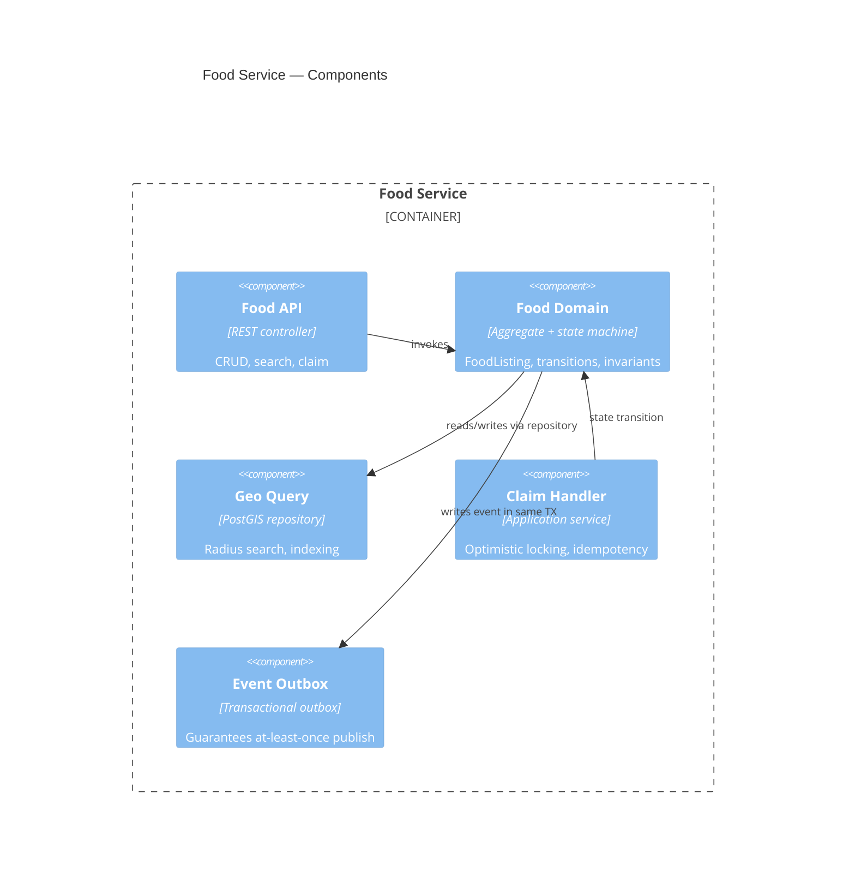

# FoodLoop — Architecture Overview

## 1. Product framing

FoodLoop is an AI-augmented, event-driven, geospatial, multi-tenant food-rescue platform.
It is not a delivery clone, not a CRUD app, and not a chatbot. The AI layer performs bounded,
tool-mediated operational work (classification, matching support, expiry-risk detection,
NGO coordination, risk scoring) inside a deterministic system of record. Deterministic code
owns every decision where correctness, money, or safety is at stake; the LLM owns reasoning,
extraction, and orchestration over tools that are individually authorized, validated, and audited.

## 2. Guiding constraints (from spec, non-negotiable)

- Deterministic algorithms handle distance, eligibility, state transitions, ranking math, and
  environmental-impact formulas. LLMs reason and orchestrate; they never become the source of truth.
- No agent has standing DB access — only typed, authorized, audited tools.
- Every AI-critical path (claiming, pickup, listing management) must keep working if every AI
  provider is down.
- No fake AI (keyword-matching dressed up as classification) and no fake data path in production
  code — mock providers must be explicit and dev-only.
- Build a modular monolith-of-bounded-contexts first; extract services only where the domain
  boundary, data ownership, and scaling profile actually diverge. Don't create empty services to
  satisfy the diagram.

## 3. C4 — Level 1: System Context

## 4. C4 — Level 2: Containers

## 5. C4 — Level 3: notable component view (Food Service)

## 6. Architectural style decisions

- **Modular monolith of bounded contexts, deployed as separately buildable Spring Boot modules**
  sharing one deployable initially where practical (Phase 1–4), split into independently deployed
  services once a context shows an independent scaling or failure profile (AI Orchestration and
  Food are the first candidates to split, since they have the most divergent load and latency
  characteristics). See ADR-003.
- **Hexagonal/ports-and-adapters per module**: domain core has no framework dependency; adapters
  for REST, JPA, Kafka, and AI tools sit at the edges. This is what makes the AI-fallback and
  provider-abstraction requirements (§29) tractable — the domain doesn't know an LLM exists.
- **DDD tactical patterns**: aggregates (FoodListing, PickupTask, MatchProposal, NgoRequest, RiskCase)
  own their invariants; value objects (Money-like: Quantity+Unit, GeoPoint, TimeWindow, DietaryType)
  replace primitives; domain events are the seam to the event bus via transactional outbox.
- **API-first**: OpenAPI contracts in `packages/shared-contracts` are the source of truth; both
  backend controllers and generated frontend clients are derived from them.
