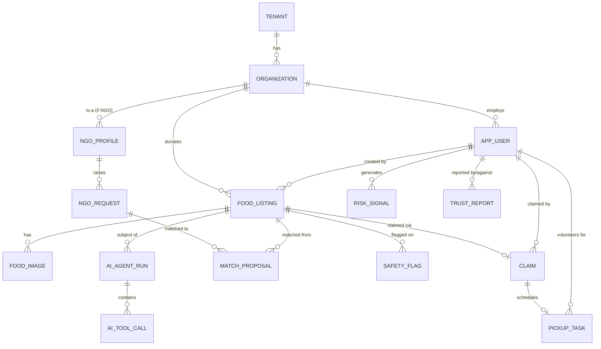

# Database Design

Each bounded context owns a dedicated PostgreSQL schema (`identity.*`, `tenant.*`, `food.*`,
`matching.*`, `pickup.*`, `ngo.*`, `trust.*`, `impact.*`, `ai.*`), same cluster initially, so a
future physical split only means moving a schema to its own instance — no data-model rework.
PostGIS extension lives on the `food` schema (and `ngo`/`pickup` where geo queries apply).

## 1. Core entities (ER overview)



## 2. Key tables (selected)

### `food.food_listing`
```
id                    uuid PK
tenant_id             uuid NOT NULL
donor_org_id          uuid NOT NULL
donor_user_id         uuid NOT NULL
title                 text NOT NULL
description           text
food_category         text NOT NULL        -- enum: COOKED_MEAL, PACKAGED, PRODUCE, BAKERY, DAIRY, ...
dietary_type          text[]                -- VEGETARIAN, VEGAN, NON_VEG, HALAL, JAIN, ...
allergens             text[]
quantity_value        numeric NOT NULL
quantity_unit         text NOT NULL         -- SERVINGS, KG, BOXES, ...
estimated_servings    integer
preparation_time      timestamptz
expiry_time           timestamptz NOT NULL
pickup_start_time     timestamptz NOT NULL
pickup_end_time       timestamptz NOT NULL
location              geography(Point,4326) NOT NULL
approx_location       geography(Point,4326)  -- privacy-degraded point for public discovery, §33
status                text NOT NULL          -- state machine, see §11
verification_status   text NOT NULL          -- UNVERIFIED, AI_REVIEWED, HUMAN_VERIFIED
ai_metadata           jsonb                  -- structured agent output, versioned
version               bigint NOT NULL DEFAULT 0   -- optimistic locking
created_at            timestamptz NOT NULL
updated_at            timestamptz NOT NULL
```
Indexes: `GIST(location)`, `GIST(approx_location)`, `(tenant_id, status, expiry_time)`,
`(tenant_id, donor_org_id)`. Partition candidate (Phase 12): range-partition by `created_at` month
once volume warrants.

### `food.claim`
```
id                uuid PK
food_listing_id   uuid NOT NULL REFERENCES food_listing(id)
receiver_user_id  uuid NOT NULL
receiver_org_id   uuid
idempotency_key   text NOT NULL
status            text NOT NULL   -- PENDING, CONFIRMED, EXPIRED, CANCELLED
claimed_at        timestamptz NOT NULL
expires_at        timestamptz NOT NULL
UNIQUE (food_listing_id) WHERE status IN ('PENDING','CONFIRMED')   -- prevents double-claim
UNIQUE (idempotency_key)
```
The partial unique index is the actual double-claim guard; it is enforced *in addition to*
optimistic locking on `food_listing.version`, so a claim requires: read listing version → attempt
`UPDATE ... WHERE id=? AND version=?` transition to RESERVED → insert claim row in the same
transaction. Either failure aborts the whole transaction.

### `pickup.pickup_task`
```
id                uuid PK
claim_id          uuid NOT NULL
food_listing_id   uuid NOT NULL
volunteer_user_id uuid
status            text NOT NULL  -- UNASSIGNED, ASSIGNED, EN_ROUTE, ARRIVED, COMPLETED, NO_SHOW, CANCELLED
scheduled_window  tstzrange NOT NULL
pickup_location   geography(Point,4326) NOT NULL
dropoff_location  geography(Point,4326)
completed_at      timestamptz
version           bigint NOT NULL DEFAULT 0
```

### `ngo.ngo_request`
```
id                 uuid PK
tenant_id          uuid NOT NULL
ngo_org_id         uuid NOT NULL
needed_servings    integer NOT NULL
dietary_constraints text[]
needed_before      timestamptz NOT NULL
radius_km          numeric NOT NULL
priority           text NOT NULL   -- LOW, MEDIUM, HIGH, CRITICAL
status             text NOT NULL   -- OPEN, PARTIALLY_FULFILLED, FULFILLED, EXPIRED, CANCELLED
```

### `matching.match_proposal`
```
id                uuid PK
food_listing_id   uuid NOT NULL
ngo_request_id    uuid              -- nullable, may match individual receiver instead
receiver_user_id  uuid
score             numeric NOT NULL       -- deterministic ranking score
score_breakdown   jsonb                  -- distance, urgency, reliability components
ai_rationale      text                   -- LLM explanation, advisory only, never authoritative
status            text NOT NULL   -- PROPOSED, ACCEPTED, REJECTED, EXPIRED
created_by         text NOT NULL   -- 'SYSTEM' | 'AGENT:<agent-name>'
```

### `trust.risk_signal` / `trust.trust_report` / `trust.safety_flag`
```
risk_signal: id, tenant_id, subject_user_id, signal_type, weight, source, created_at
trust_report: id, tenant_id, reporter_user_id, subject_user_id/subject_listing_id, reason, status
safety_flag: id, tenant_id, food_listing_id, flag_type, severity, raised_by ('AGENT'|'USER'|'RULE'),
             requires_human_review boolean, resolved_by, resolved_at
```
`risk_signal` rows are append-only inputs to a deterministic scoring function (weighted sum +
decay, not an LLM); the score and `recommendedAction` land in a `trust.risk_case` row that a human
reviews before enforcement (§21, §26).

### `ai.agent_run` / `ai.tool_call`
```
agent_run: id, tenant_id, agent_name, trigger_event_id, status, started_at, completed_at,
           model_provider, model_name, prompt_version, input_ref, outcome_summary,
           escalated boolean, total_tokens, total_cost_usd
tool_call: id, agent_run_id, tool_name, input_json, output_json, authorized_scope,
           status (SUCCESS|DENIED|FAILED), latency_ms, created_at
```
`outcome_summary` stores a redacted decision summary, not raw chain-of-thought (§38).

## 3. Vector store

`ai.document_chunk` (pgvector): `id, tenant_id, region, language, source_doc_id, doc_version,
effective_date, chunk_text, embedding vector(1536), metadata jsonb`. HNSW index on `embedding`;
btree on `(tenant_id, region, language)` for pre-filtering before similarity search.

## 4. Multi-tenancy enforcement at the data layer

Every table in every schema carries `tenant_id`. Row-level security (Postgres RLS) is enabled per
table, keyed off a session-scoped `app.current_tenant` GUC set by a connection interceptor at the
start of every request — this is the actual isolation boundary, not just an application-layer
`WHERE tenant_id = ?` convention (defense in depth: a missed `WHERE` clause in application code
still can't leak cross-tenant rows). See ADR-009 and the threat model (§ threat-model doc).
